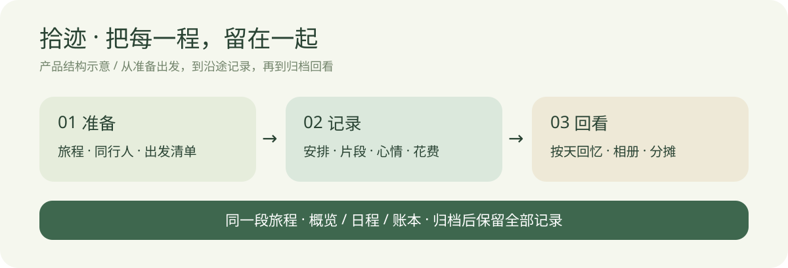
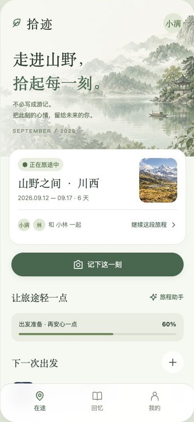
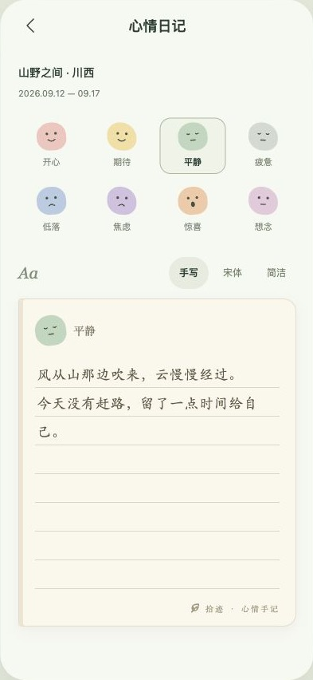
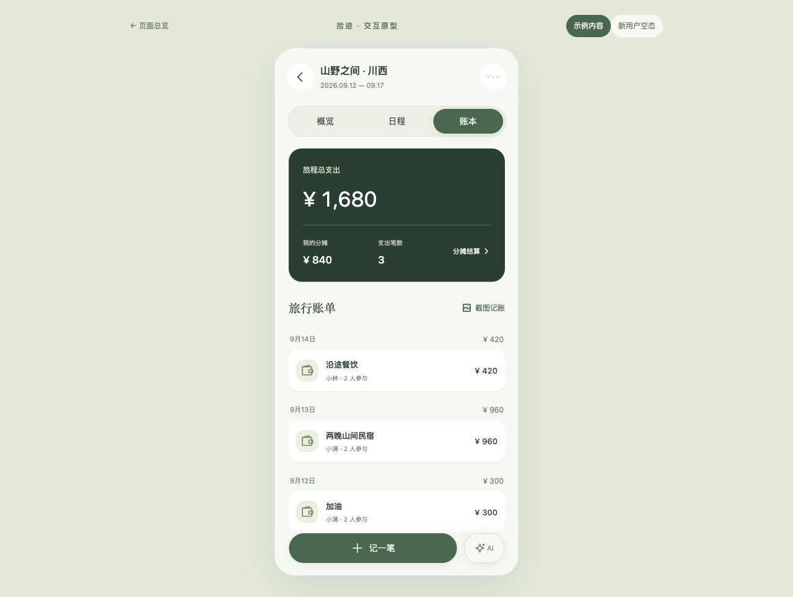
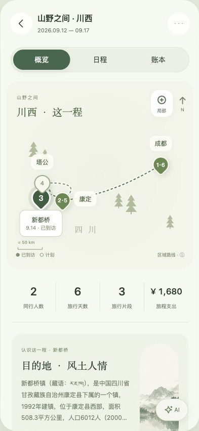
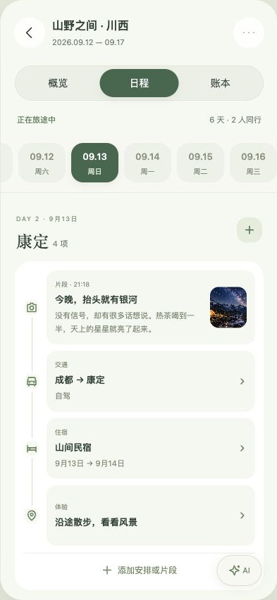
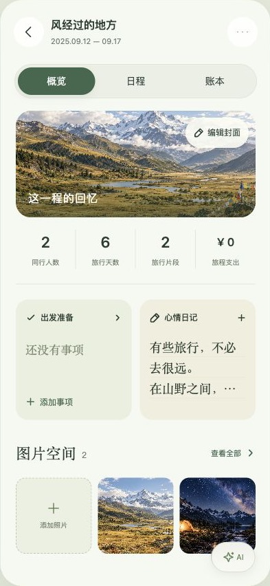

# 拾迹 Shiji · 让旅行留下来

**一个从产品设计、交互原型到微信小程序开发的个人实践项目。**

把旅行安排、沿途片段、心情、照片和花费收在同一段旅程里，让「正在经历」自然变成「值得回看」。

[在线体验 Web Demo](https://yyshining.github.io/shiji/) · [产品设计说明](docs/PRODUCT.md) · [小程序开发进度](docs/STATUS.md) · [素材说明](ASSETS.md)

> 展示基准是 **Web 高保真交互原型**。微信小程序开发中，尚未正式上线；本仓库不将演示数据、模拟能力或单次联调结果描述为真实用户成果。



## 为什么做拾迹

一次旅行的安排、照片、随手记和共同花费，往往分散在聊天、相册、备忘录和记账工具里。旅行结束后，照片还在，但当时的心情、每天发生的事情和同行人的故事容易失去关联。

拾迹围绕一个产品假设展开：**以「旅程」作为统一容器，降低记录门槛，减少旅行前、中、后的内容割裂。** 这是一项场景驱动的设计探索，尚未通过正式用户研究或规模化数据验证。

## 主要功能

| 场景 | 可体验的设计与交互 |
| --- | --- |
| 准备出发 | 新建旅程、日期与同行人；出发清单勾选、编辑和拖拽排序 |
| 旅途记录 | 文字与照片片段；交通、住宿、体验安排；具体日期编辑 |
| 看整段行程 | 日程总览以每日内容分布呈现旅程节奏，再进入当天明细 |
| 记录心情 | 表情选择、纸张横线、字体切换、日记自动保存 |
| 管理花费 | 支出、付款人与参与人、均摊、AA 归还与结算余额 |
| 结束回看 | 归档保留清单、日记、照片和账本；按天回看，筛选交通与住宿 |
| 整理回忆 | 回忆年月筛选、图片空间、封面与标题编辑、历史照片手动归入旅程 |
| 辅助信息 | 示例地点路线示意、天气与当地资料入口；失败和空态处理 |

### 界面预览

以下为公开版 Web 原型截图。示例人物、行程和金额用于演示；风景图为 AI 生成示意素材。

<table><tr><td width="33%"></td><td width="33%"></td><td width="33%"></td></tr><tr><td align="center">旅程入口</td><td align="center">心情手记</td><td align="center">共享账本</td></tr></table>

<table><tr><td width="33%"></td><td width="33%"></td><td width="33%"></td></tr><tr><td align="center">旅程概览</td><td align="center">单日日程</td><td align="center">归档回忆</td></tr></table>

概览中的路线为地点关系示意，公开版不包含行政边界；截图使用仓库自带的示例数据。

## 三个关键产品决策

**1. 阶段不同，内容归属一致。** 首页保留「在途 / 回忆」方便找到当前旅行；进入旅程后统一「概览 / 日程 / 账本」。归档改变状态，不搬走日记、不丢失清单，也不生成一套孤立数据。

**2. 总览负责概括，日期负责细节。** 用每日安排与片段的分布概括旅行节奏，避免把所有日期的明细再罗列一遍。没有记录的日期保留空白，允许事后补记。

**3. AI 先给草稿，人确认后入库。** 小程序正在实践「粘贴行程文字 → 提取交通 / 住宿等结构化草稿 → 人工核对 → 保存」；不把模型输出直接写成已经发生的经历。Web 的 AI/OCR 入口主要演示流程，不提供真实模型服务。

## 我的工作与 AI 协作

本项目由作者提出场景与需求、选择视觉方向、决定信息架构和交互规则，并通过原型评审与截图反馈推进迭代；借助 AI 辅助完成界面代码、微信迁移、测试与问题修复。

重点展示的是**需求拆解 → 可交互原型 → 发现问题 → 调整产品规则 → 验证实现**的过程，并非宣称所有代码由作者独立手写。具体取舍与案例见 [产品设计说明](docs/PRODUCT.md)。

## 当前进度

- **Web：** 可运行的高保真原型，主要交互使用浏览器本地存储；是本次作品集展示基准。
- **微信小程序：** 已建立原生工程，迁移主要页面与本地记录流程；UI 对齐、兼容性和真机验收尚未全部完成，当前暂停继续调整。
- **云端与 AI：** 已实现云函数、手动备份/取回和模型适配代码。开发环境已完成一次 DeepSeek 真实文本提取联调；跨设备恢复、权限隔离及完整异常流程仍需实际验证。
- **未完成：** 正式发布、生产级同步与协作、真实图片 OCR、完整真机验收。无真实用户规模或商业效果数据。

公开仓库中的 AppID 和云环境为空配置，**不会连接作者的微信环境**。详细证据与限制见 [开发状态](docs/STATUS.md)。

## 本地运行

Web 无需构建或安装前端依赖。需要 Python 3：

```sh
python3 -m http.server 8767 --bind 127.0.0.1
```

打开 `http://127.0.0.1:8767/`。页面右上角可切换「示例内容 / 新用户空态」。建议体验：进入旅程 → 日程 → 添加片段 → 账本 → 回忆。

数据保存在当前浏览器；清除站点数据会丢失记录。不同浏览器、设备与地址之间不自动同步。请使用演示内容体验，避免填入私人资料。

### 工程结构

```text
app/                         Web 原型（HTML / CSS / JavaScript）
assets/                      AI 生成演示图像
miniprogram/                 原生微信小程序（WXML / WXSS / JavaScript）
cloudfunctions/shijiGateway/ 云函数、模型适配与备份逻辑
tests/                      Web 回归检查
docs/                        产品说明、进度和界面截图
```

微信开发者工具导入仓库根目录，并配置自己的 AppID。云端依赖与部署说明见 [cloudfunctions/README.md](cloudfunctions/README.md)。模型密钥仅配置在云函数环境变量中。

### 验证

需要 Node.js，无需第三方测试依赖：

```sh
node tests/journey-regression.cjs
node miniprogram/tests/model.test.cjs
node miniprogram/tests/navigation.test.cjs
node miniprogram/tests/cloud.test.cjs
```

测试覆盖日期与住宿边界、归档保留、均摊计算、导航和模拟云接口。自动化通过不等于微信真机、云权限或生产可用性已验收。

## 公开版说明

保留本地原型的主要界面、交互和配色。公开版将两张来源未核清的风景照片替换为 AI 生成示意图，并省略未核清再分发条件的行政边界数据；路线保留地点与先后关系，不用于导航。代码尚未选择开源许可证；公开可浏览不代表授予额外再分发许可。详见 [素材与使用边界](ASSETS.md)。
